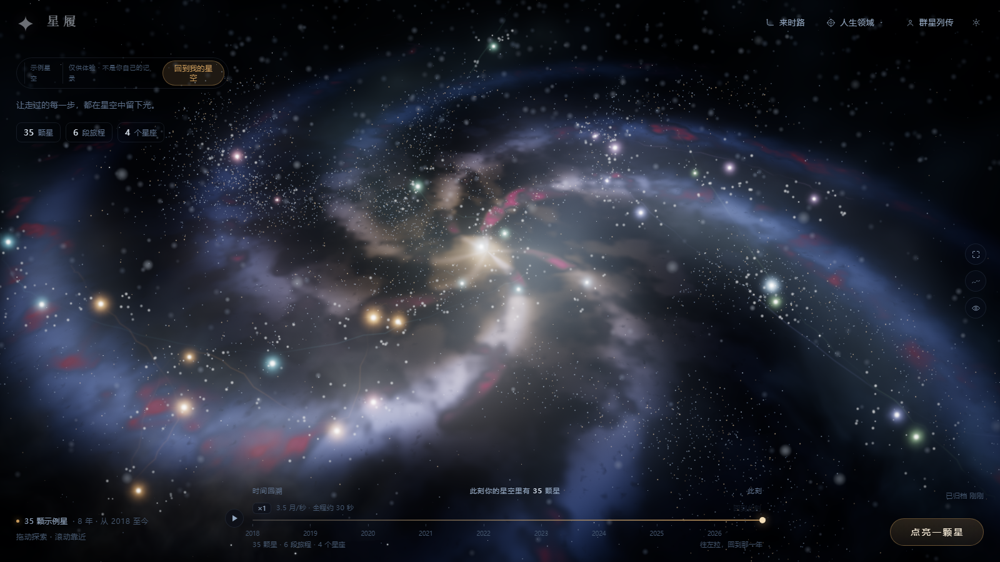
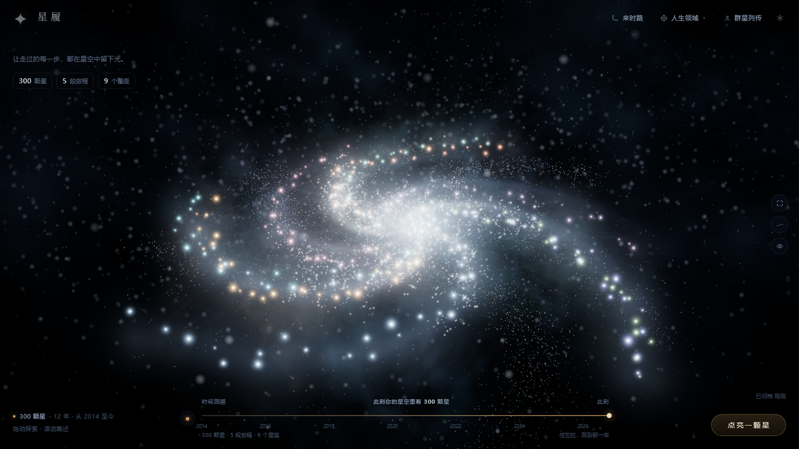
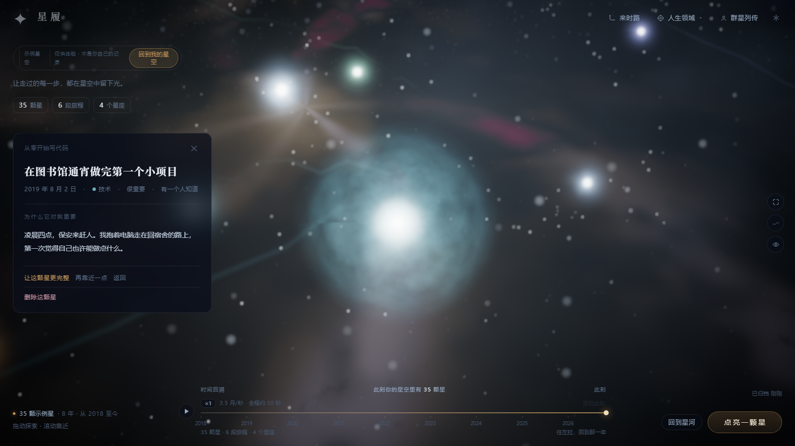
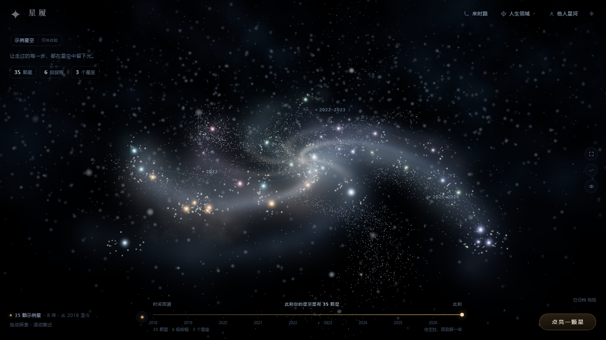
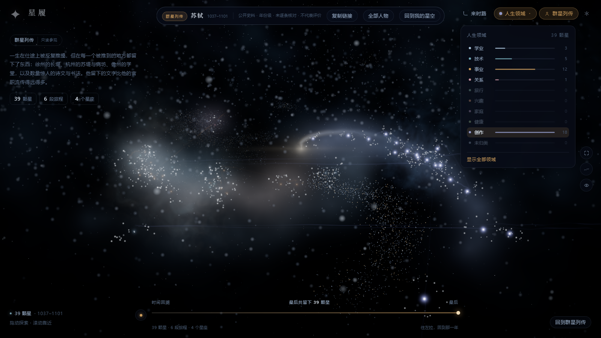
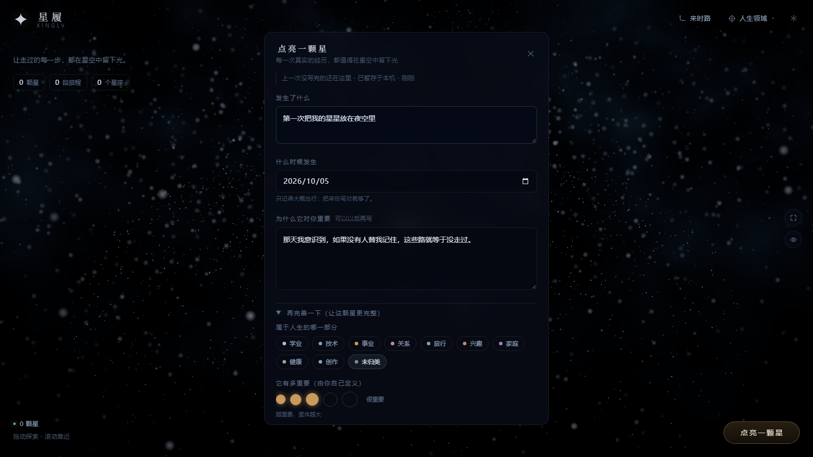
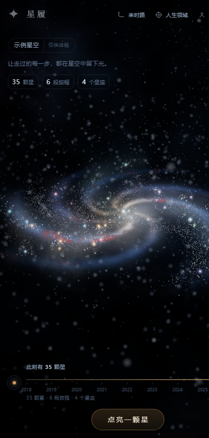
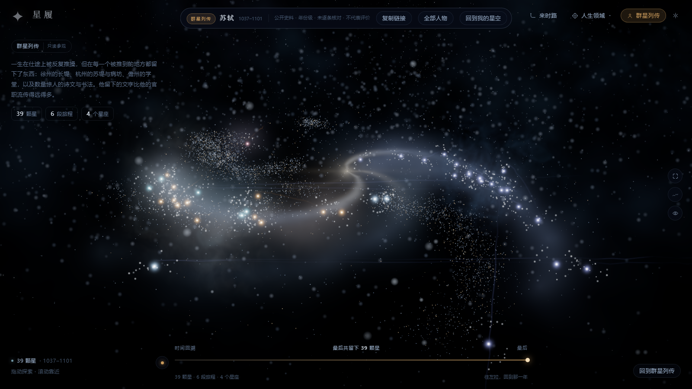
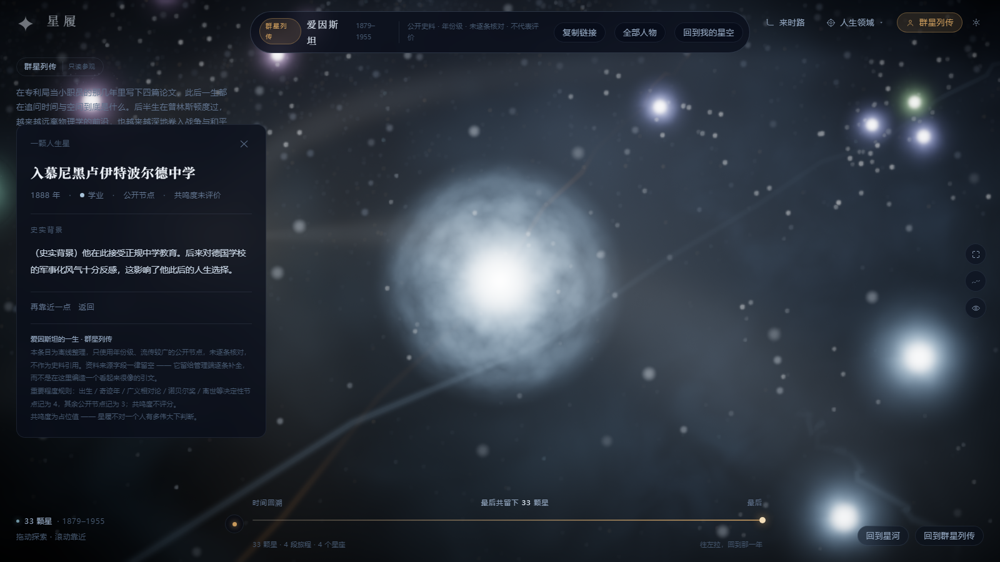
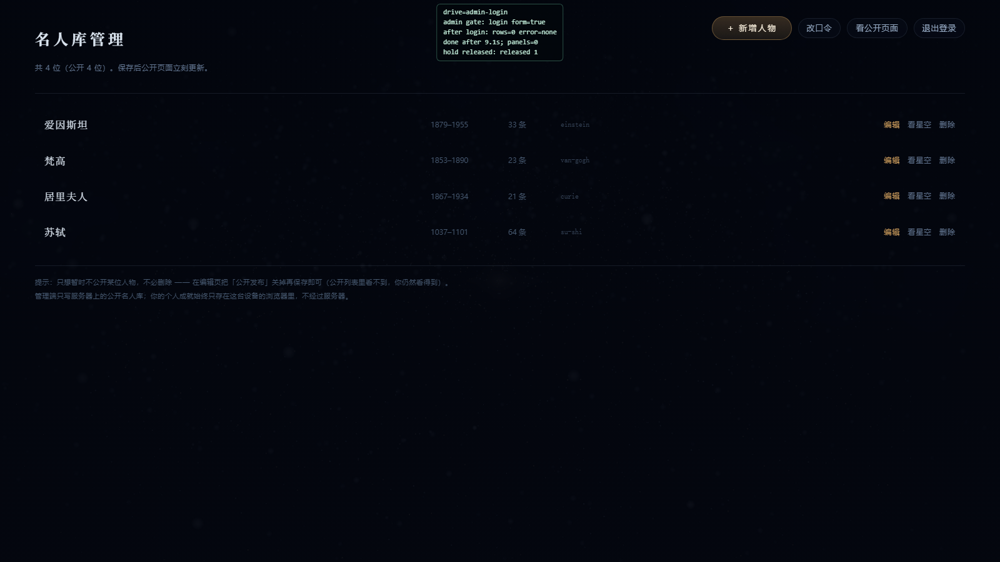

# 星履 · XingLv

> 让走过的每一步，都在星空中留下光

[](https://github.com/sl413/xinglv-dsh/actions/workflows/ci.yml)
[](https://github.com/sl413/xinglv-dsh/actions/workflows/pages.yml)

## 在线预览

**<https://sl413.github.io/xinglv-dsh/>** —— 点开就能用，不用安装任何东西。

这是纯静态构建（`VITE_STATIC=1`）：所有记录只存在**你自己的浏览器**里，
线上版本没有服务器、没有管理端，群星列传用的是打包进前端的只读种子库。
想用完整功能（含管理端与多代备份），在本地跑 `pnpm start` 打开 <http://127.0.0.1:5274/>。

分享也给这个地址：深链 `/lives`、`/life/<id>` 都能直接打开。
仓库页的入口在右侧 **About → 站点链接** 与 **Environments → github-pages**。

## 本地运行

```bash
pnpm install
pnpm dev                        # 开发（5273）
pnpm build && pnpm start        # 构建 + 应用服务器（5274，含群星列传与管理端）
pnpm seed                       # 重新生成名人库种子（含收录范围检查）
pnpm check:encoding             # 编码与控制字符体检
pnpm test:pure                  # 纯函数断言（时间解析 / 坐标映射 / 逆函数 / 散布统计）
pnpm test:qa                    # 浏览器功能与流畅度断言（需先 build + start）
pnpm shot <名字> <路径> <端口>   # 可靠截图（显式等待渲染完成）
pnpm static:preview             # 模拟 GitHub Pages 的纯静态预览（5277）
```

跑 `pnpm test:qa` 前要先设管理端口令（测试里有几条要登录管理端，口令不写进仓库）：

```bash
XINGLV_ADMIN_PASSWORD=你的口令 pnpm test:qa        # bash
$env:XINGLV_ADMIN_PASSWORD='你的口令'; pnpm test:qa # PowerShell
```

管理端只写服务器上的公开名人库；**你的个人成就始终只存在这台设备的浏览器里，不经过服务器**。

星履不是日记、不是 Todo、不是打卡，也不是社交产品。它是一套**让人看见自己走过的人生可视化系统**：
你每记下一次真实的经历、重要节点或对自己有意义的改变，三维人生星空中就真的亮起一颗星。
学业、技术、事业、关系、旅行、兴趣、家庭、健康、创作会慢慢聚成星座、星团与星云，
同一段成长路径上的经历被柔软的星轨连起来。

拉远镜头，你看见的是一片只属于自己的星河。



记录得越多，这片星河越大、越亮、越壮观 —— 星臂会更亮、核球会更实、盘面星尘会更厚：



| 靠近一颗星 | 时间回溯 |
| --- | --- |
|  |  |

| 人生领域 | 人生星座 |
| --- | --- |
|  |  |

| 点亮一颗星 | 移动端 |
| --- | --- |
|  |  |

**群星列传**：一个公开的、由站长维护的名人库。匿名就能浏览；点一位人物进入属于他自己的星空。

| 人物列表（可搜索） | 某位人物的星空 |
| --- | --- |
|  |  |

| 人物的某一颗星（只读 · 史实背景） | 管理端（只有登录后可见） |
| --- | --- |
|  |  |

（以上截图全部来自无头浏览器对**构建产物**的真实操作；第一次进入的界面见 `docs/shots/09-entry.png`。
复现方式见文末「验收与自测」。）

---

## 一、它长什么样

四个空间层级同时实时渲染，各自以不同速度运动，形成真实视差与纵深：

| 层级 | 内容 | 实现 |
| --- | --- | --- |
| 0 · 星河 | 十道星臂的辉光、核球、盘面星尘 | 躺在星盘平面里的解析式螺旋盘（十臂脊线 + 暗尘带）+ 沿臂辉光 billboard + 星尘点云 |
| 1 · 极远 | 银河背景 + 约 1.9 万颗极远恒星（26 个疏散星团） | 反向球壳自定义 Shader（FBM 银河带/暗尘）+ `BufferGeometry`/`Points` |
| 2 · 中距 | 动态星云、宇宙尘埃 | 自定义 billboard 簇（域扭曲 FBM、暗尘带）+ 差速公转的尘埃点云 |
| 3 · 人生 | 人生星、环绕星尘、星轨 | `InstancedBufferGeometry` 自绘星体着色器 + 顶点着色器算轨道的星尘 + 自绘 ribbon 星轨 |
| 4 · 近景 | 永远包着相机的漂浮微粒 | 顶点着色器对相机坐标取模的无限微粒场 |

### 一条重要的设计原则：星河会随你记录的数量长大

「层 0」是星河的**形态**，不是数据：它由十道星臂的解析式螺旋构成，
每条星臂的亮度由**这个领域真实的经历数量**决定，没有经历的地方就是暗的。
整片星河的体量（星臂亮度、核球实度、盘面星尘数量）都随真实记录数增长：

```
gasScale  = clamp01(0.36 + N/42)        // N = 你记录了多少次经历
coreScale = clamp01(0.34 + N/46)
dustCount = clamp(N × 165, 2200, 8400)
```

于是：刚认识星履时，星臂只是几缕几乎看不见的轮廓；
记得多了，同一片星空会自己变得厚重、明亮、壮观。
**真正代表经历的，始终是落在星臂上的那些锐利星点与星轨。**

光影遵循「80% 黑暗、20% 光」：配色只用深靛蓝、雾青、冷白、暗紫灰、琥珀金、淡玫瑰
这一类低饱和深空色。泛光 → 景深 → 暗角 → 噪点 → ACES 色调映射，全部在 HDR 空间里做。
相机飞进盘面时，盘面辉光会自动收起来，避免近看一颗星时整屏糊成灰雾。

启动过程本身就是一段编舞：**先只有深空 → 极远恒星亮起 → 星云浮现 → 尘埃可见 →
人生星按时间顺序被依次点亮（相当于用几秒重看一遍自己走过的路）→ 星轨生长 → 镜头推近**。
没有白屏，也没有巨大的 Loading。

---

## 二、快速开始

```bash
pnpm install          # 依赖
pnpm build            # 类型检查 + 生产构建（输出 dist/）
pnpm start            # 启动应用服务器（http://127.0.0.1:5274）★ 正常使用入口
pnpm seed             # 从 scripts/seed-source/ 重新生成名人库种子

pnpm dev              # 只跑前端（http://127.0.0.1:5273，/api 自动转发给 5274）
pnpm preview          # 验收预览服务（http://127.0.0.1:5276，静态托管 + 代理 /api）
pnpm typecheck        # 只做类型检查
```

> **要完整使用（含群星列传的登录与编辑），请 `pnpm build && pnpm start`。**
> 只跑 `pnpm dev` / `pnpm preview` 而没有应用服务器时，群星列传会进入
> **内置名人库的只读模式**：人物列表和人物星空照常浏览，但登录与编辑不可用。

> 环境要求：Node 20+ / pnpm。本仓库的 `pnpm-workspace.yaml` 固定了
> `nodeLinker: hoisted`，因为受限环境下 Node 的 ESM 解析穿不过 Windows junction。

第一次启动应用服务器时会生成管理员口令并打印在控制台：

```
  ┌──────────────────────────────────────────────┐
  │  第一次启动，已生成管理员口令：              │
  │      xinglv-xxxxxxxx                         │
  └──────────────────────────────────────────────┘
```

也可以自己指定：`XINGLV_ADMIN_PASSWORD=你的口令 pnpm start`。登录后可以改口令。

第一次打开是入口页，三个选择：

- **点亮我的第一颗星** —— 直接开始记录自己的人生
- **先看看一片示例星河** —— 载入一段虚构的 35 颗星人生（可一键清空），用来先看看这片星空长什么样
- **看看群星列传** —— 进入公开的名人库，浏览别人一生的星图

想立刻看到「拉远之后的那片星河」，选第二个，然后双击画面空白处。

### 首页怎么读

界面只在四角留极少信息，中间的星河是唯一的主角：

```
✦ 星履 / XINGLV                    来时路   人生领域 ▾   ⚙
示例星空 [仅供体验]
让走过的每一步，都在星空中留下光。
[35 颗星] [6 段旅程] [3 个星座]                          ⛶ ◐

                    · 一片实时渲染的人生星河 ·

● 35 颗示例星 · 8 年 · 从 2018 至今
拖动探索 · 滚动靠近          ▶ 时间回溯 ──●────────── 此刻      点亮一颗星
                              2018 2020 2022 2024 2026
```

- **来时路** —— 把所有经历按年份倒序列出来。想看「我到底做过什么」的时候用它。
- **人生领域** —— 九个领域各有多少颗星；点一个，那一条星臂被点亮，
  其余的星臂、星体与盘面星尘一起退到很暗。**这不是筛选：星一颗都不会消失，
  只是把光集中到一条路上。**
- **时间回溯** —— 底部那条横贯的轴。往左拉，未来星熄灭、星轨消散、盘面结构一起退去。
- **右侧两个圆钮** —— 回到整片星河 / 显示或隐藏星轨 / 显示或隐藏星座标注。
- **点亮一颗星** —— 唯一的主行动，始终在右下角。

### 点一颗星之后

原来点下去会立刻弹出一块故事面板，然后这块面板**干等镜头飞两三秒**才等到目标 —— 整段过渡里最生硬的一环。现在改成**让面板随镜头一同抵达**：

1. **点击** → 镜头几乎立刻起航（起飞前的停顿从 0.4s 收到 0.12s）；
2. **飞行途中** → 星空里什么都不出现。面板已经挂在原位，但完全不可见（`opacity: 0`、模糊 7px）；
3. **抵达那一刻** → `CameraRig` 在飞行结束的那一帧发出一次抵达信号，面板才浮上来：
   900ms 不透明度 + 从模糊 8px 到清晰，内部内容按 80→170→260→350→470ms 依次浮现。
   **只用透明度与清晰度，位置一律不动。**
4. **近景细节**（星核的丝状湍流）的时间常数也改成与帧率无关的指数逼近，
   低帧率下不再一顿一顿地冒出来。

为什么强调「位置不动」：第一版让面板上移 26px、里面的字再各自上移 9px，
而同一时刻镜头里的目标星还在下移 30px —— 字往上冲、星往下沉，整幅画面读起来就是**上下抖动**。
实测把三个值钉死之后（`panelTop=177 titleTop=238 storyTop=396 starY=372` 跨 14 秒恒定），
过渡才真正安静下来：不再有位移，只有光与清晰度浮上来。

如果抵达信号因为飞行被打断而丢失，面板会在 3 秒后自己出现 —— 不会把内容永远藏着。

### 关于「线条」与「文字」

星空中不应该出现被画上去的线，也不应该出现任何文字。

- **星空里一个字都没有。** 星座的浮动标注（曾经标着「家庭 · 2022–2023」这类时间段）整层去掉了；
  鼠标停在一颗星上时只浮现它的名字，不显示日期。常态下的星河是完全纯净的。
- 那么**星座怎么进**？右侧第三个圆钮（眼睛）打开「星河概览」面板 —— 面板在星空之外 ——
  里面列出每一个人生星座与它的星数，点一行就聚焦那一团星。键盘 `O` 也是同一个入口。
  （顺带说明：3D 场景里星座其实也可以拾取，但拾取规则是「星永远优先」，
  而星座中心必然被自己的成员星围住，所以实测点不到 —— 这也是当初必须有标注的原因。）
- **星轨**默认极轻（约为早期版本的 30%），并且沿轨道断成柔软的光节、两端自然淡出 ——
  它的作用是暗示「这些经历属于同一段路」，而不是在星盘上拉一根线；
  一段旅程里的经历越多，单条越淡。
- **十字星芒**被压到几乎看不见，只有最亮的那几颗星才有一点点。
- 如果连这点暗示也不想要，右侧第二个圆钮可以**把星轨整个关掉**，一颗都不剩。
- **主界面上也不出现领域名**。领域名只留在用户自己打开的面板里
  （人生领域下拉、星球故事、星河概览）；领域高亮时顶栏按钮只留一个**色点**。
- 领域高亮时，星臂的辉光是**带**（有宽度、有暗尘带的盘面结构），不是描边的线。

---

## 三、人生星河坐标学（核心设计）

`src/core/layout.ts` 是整个应用的天体力学。它必须同时满足三件事：**稳定、可读、有纵深**。

```
R0 = 0.85, R1 = 11.8, WIND = 2.55, POW = 1.15   （src/core/layout.ts · GALAXY）

时间 t ∈ [0,1]（0 = 记载的起点，1 = 此刻）
  半径 R = R0 + (R1-R0)·t^1.15        ← 早期经历向中心聚拢，堆出一颗明亮的核球
  方位 θ = 扇区(领域) + 2.55·t         ← 同一领域排在同一条星臂上，随时间弯曲
  高度 Y = 薄盘起伏 + 盘面波动 + 核球加厚 ← 越靠中心盘越厚，像真实星系的核球
重要程度 → 星体大小
共鸣/被见证程度 → 亮度与外辉
```

推论出来的几个性质，是产品语义的关键：

- **往回走 = 星河往里收。** 时间不是筛选器，而是宇宙本身的一维。
- **同一领域、时间相近的经历会自动聚成星座**（`constellations`），
  于是「那几年我到底在忙什么」可以被一眼看见。
- **同一段旅程的经历被星轨连起来**（`trails`），星轨是一条柔软的 ribbon。
- 位置由 `hash32(事件 id)` 决定，**同一段经历在任何机器、任何刷新之后都在同一个位置。**

取景几何用「所有人生星的重心 + 包围半径」，而不是原点 ——
只有一颗星的时候，「看向原点」会把它甩到画面边缘，而「看向它自己」才是对的。

---

## 四、Camera Director：全应用只有一处能动相机

`src/universe/camera/CameraDirector.ts` 是一个显式的状态机：

```
free ──focus──▶ hold ─▶ fly ─▶ settle ─▶ focused ──返回──▶ returning ─▶ free
  ▲                                                              │
  └──────────────── glide（滑向整片星河）──────────────────────────┘
```

- **自由漫游**：带阻尼与惯性的球面环绕。拖动即跟手（时间常数 85ms），松手有余势，
  滚轮/双指对数缩放，右键/双指平移。
- **聚焦飞行**：0.4s 停顿 → 平滑加速 → 弧线飞行（视线先看向飞行前方、再逐渐转向目标星）
  → 穿越星尘 → 减速 → 视场收窄（焦点变化）→ 景深缓缓进入。
- **返回**：沿一条更短的弧线，精确回到**进入前**的相机位置、观察方向、缩放层级与上下文。
- 加速/巡航/减速的比例由一条**速度包络积分**得到（`velocityProfileEasing`），
  不是套一个对称的 ease —— 这是镜头「有重量」的关键。
- 低端设备上动画用真实帧间隔推进，只有「从后台切回来」那种几秒级的大跳才会被丢弃。

点击/拖拽手感：

- 严格区分点击与拖动：位移 < 6px 且 < 340ms 才算点击；
- 判定用的是**事件自身的时间戳**，所以主线程卡顿不会把用户的快速点击误判成拖动；
- Hover 只轻微增强光芒，绝不改变镜头；按下有克制反馈；确定点击后才执行聚焦；
- 拾取是解析式屏幕投影：拾取半径由星体实际大小的投影决定（约 12–72px），
  大星更好点、小星也点得到；**观测时刻之后的星不可拾取**（未来是未知的）；
- 移动端单指旋转、双指缩放与平移，双指期间绝不产生点击。

---

## 五、点亮一颗星，与它的诞生仪式

首屏只问三个问题：**发生了什么、什么时候发生、为什么它对你重要**。
其余一切（领域、重要程度、被见证程度、属于哪段旅程、见证人、标签）都在「再完善一下」里，
而且可以永远不填 —— **先留下，再完善**。

提交后播放新星诞生仪式（`src/universe/ceremony/NovaCeremony.tsx`，9.4 秒）：

```
0.0s  环境轻微变暗 —— 其他星辰让出一点光
0.35s 微光出现 —— 一切从一个几乎看不见的点开始
1.0s  星尘受引力影响，一边缓慢旋转一边向这个点汇聚
2.3s  核心收缩，同时增强 —— 越收越亮
3.4s  柔和的光向四周扩散
3.9s  新星稳定形成，光晕缓缓出现
4.2s  相关的旧星向它缓慢生长出星轨
6.6s  镜头拉远 —— 让人看见它已经成为自己人生星河的一部分
```

**没有抽卡、没有爆炸、没有金币、没有升级、没有数值飞出。**
仪式的重量来自光和镜头，文字只在很晚出现一句：「它已经成为你星河的一部分」。

---

## 六、时间回溯

底部那条横贯的轴是宇宙本身的一维：左端是记载的起点，右端是此刻。往左拉：

- 未来星逐渐熄灭、光晕收缩到 40%；
- 星轨从那一段开始自行消散；
- 星云与星臂盘面结构一起退去（变稀薄、变冷、变朦胧）；
- 相机顺势靠近一点，让构图始终成立；
- 未来区域始终保持黑暗、朦胧与未知。

不是「筛掉了哪些条目」，而是**真的回到那一年，看见当年的我拥有怎样的星空**。

---

## 七、群星列传

星履的主体永远是**你自己的星空**。群星列传是一个**公开的、独立的入口**：
匿名访客不需要登录就能浏览别人一生的星图，而你的个人成就始终只留在你自己的浏览器里。

### 结构：人物列表 → 人物星空

| 网址 | 是什么 |
| --- | --- |
| `/` | 我的星空（个人成就，只存本机） |
| `/lives` | **群星列传**：人物列表。姓名、生卒年份、简短介绍、成就数量，支持按姓名搜索与排序 |
| `/life/:id` | **某位人物的星空**。这个地址可以直接分享、刷新也能打开，例如 `/life/su-shi` |
| `/admin` | 管理端（只有登录后的站长可用） |

进入人物之后用的是**同一套星空**：可以自由漫游、可以按人生领域高亮、可以点开一颗星读那一年发生了什么、
可以把底部的时间轴往回拉看他哪几年最密集。人物星空的顶部常驻一条横幅，写明这是谁、
写明「公开史料 · 年份级 · 未逐条核对 · 不代表评价」，并给一个「复制链接」。

首批收录 4 位真人（共 **104 条成就**）：**苏轼**（39 条）、**爱因斯坦**（30 条）、**居里夫人**（18 条）、**梵高**（17 条）；
另有一位**明确标注的虚构人物**用于看规模（见下）。条目依公开编年补录，每条都带领域、
是否决定性成就、第三人称的史实背景，以及一个**可选的资料来源**字段。

### 时间轴可以自动播放

底部的时间轴不只是滑块 —— 按左边的**播放键**，这条轴会自己往右走，
把这一生整体重看一遍：星依次亮起、星轨一段段长出来、盘面慢慢变厚。

- **速度四档**：×0.5 / ×1 / ×2 / ×4，点速度按钮循环切换。基准是「全程时长」——
  ×1 = 30 秒走完整个时间跨度，所以 8 年的档案和 70 年的档案都成立。
- **读数说人话**：不只显示「×2」，还换算成真实的 **年/秒（或月/秒）** 与剩余时长。
- **走到最后就停**，不循环；**在终点再按播放 = 从头再来**。
- **拖动轨道会暂停播放**；**点开一颗星也会暂停**（读一颗星和看整片星空是两件事，同时发生会互相打断）。
- 键盘：轨道上按 **空格** 播放/暂停，**←/→** 微调（会先暂停）。

> 实现上有一点值得记：时间推进写在每帧循环里，但**每 80ms 才写回一次 store** ——
> 界面（时间轴、星数读数）不会 60fps 重渲染，而画面依然完全平滑，
> 因为 GPU 侧本来就在把观测时刻向目标做指数逼近。

### 删除自己的成就

星空的删除不该让人紧张，所以做了四件事：

| | |
| --- | --- |
| **入口** | 顶部「**来时路**」→ 右上角「**管理**」。列表里每行都有「删除」 |
| **批量** | 进管理态后可勾选（含全选），批量删除**必须二次确认**（按钮会变成「确认删除 N 颗」） |
| **撤销** | 删完立刻出现一条撤销提示，标明「刚删掉 N 颗：<标题>」，一键原样还回来 |
| **单个** | 点开一颗星，面板底部也有「**删除这颗星**」（有二次确认） |

两个细节：批量删十颗只写**一次**存档、留**一份**快照（不会把历史快照挤掉）；
被删的星如果让某段旅程变成 0 颗星，那段旅程会**一起清掉**（不留空壳），
撤销时连它一起还原。

> 措辞也改了：原来叫「移开这颗星」，太委婉 —— 现在直接写「删除」。

### 示例星河是可逆的，而且一眼看得出来

示例星空和「你自己的星空」在画面上长得一样，很容易让人以为「我的记录被示例顶掉了」。
所以做了三件事：

1. 示例星河的入口**只出现在空档案的进入页** —— 有记录时界面根本不提供这个选项，
   不存在「悄悄被替换」的路径；
2. 任何一次正式归档之前都会先**留一份上一版的快照**（最多 5 份）；
3. 顶部横幅上写着「示例星空 / **仅供体验 · 不是你自己的记录**」，
   旁边就是**「回到我的星空」** —— 点它就从快照里找回你自己那片；
   一份自己的快照都没有时，它不会假装恢复成功，而是如实清空、让你从第一颗星开始。

> ⚠️ 边界：**个人记录只存在你自己的浏览器里**（IndexedDB），服务器只存名人库，没有云端备份。
> 清理站点数据、换浏览器、换设备都会丢。保底手段是「档案 → 导出到文件」，导出的 JSON 可以再导入回来。

### 视觉方向：从「低饱和的深空」转向「震撼」

第一版的配色是克制的（低饱和、冷色、80% 黑暗）。后来对着参考图明确了一个更高的目标：
**像那种影视级星系壁纸一样震撼**。于是做了五处重手调整：

| 杠杆 | 改前 | 改后 |
| --- | --- | --- |
| **画幅** | 星系只占画面约一半，四周大片空白 | 取景余量 1.45 → **1.14**、默认机位 18 → **14.5**，星系铺满画面（参考图里星系本来就是溢出画框的） |
| **盘面亮度** | `uStrength 0.05 + gasScale·0.075` | **`0.075 + gasScale·0.11`** |
| **暗尘对比** | 暗带最暗压到 7% | 压到 **3.5%** —— 亮面被刻出条纹，才有塑形感 |
| **核球** | `uCore 0.7 + coreScale·0.85` | **`1.0 + coreScale·1.15`**，并分成「紧实内核 + 宽暖雾」两层 |
| **泛光** | 强度 1.05、门槛 0.165、半径 0.74、8 级 | **1.55 / 0.115 / 0.86 / 9 级** |
| **星云** | 强度 0.75 | **1.35** |
| **人生星** | 光晕 0.1 + imp·0.05 | **0.13 + imp·0.062**（更有分量） |

另外加了：**暖金色核球**（`#ffcf8a`）、**蓝色外缘**（`#6aa5ff`）、
以及沿星臂的**玫红恒星形成区**（`#ff5f6d`）—— 让它长在暗尘较薄的地方，
因为真实的星暴区就是长在尘埃被吹开的位置，两者相关而不是随机叠加。

**这是一次方向性的取舍**：原始设定里的「低饱和配色」与「80% 黑暗、20% 光」被让位于「震撼」。
如果你更想要原来那种克制的深空感，把上面六个数字收回去就行 —— 它们都集中在
`GalaxyBody.tsx` 的 uniform、`quality.ts` 的泛光档位与 `CameraDirector.ts` 的取景余量三处。

星臂是**统计上的密度脊**，不是一条排好队的曲线。这条曾经写错过：
角向抖动只有 ±0.062 rad（3.5°），而星臂间距是 36° —— 实测一千颗星
**全部**落在离脊线 0.1 rad 以内、没有一颗落在臂与臂之间，看起来就是十条串着珠子的细线。

现在的模型：

- **角向散布按弧长给**（σ_arc 基本恒定）：内圈自然并成核球，外圈仍是清楚的星臂；
- **约 16% 的「场星」**：不属于任何一道臂，散布大得多，铺在臂与臂之间，像真实星系的盘族；
- **径向也做高斯散布**，让「同一年」的星不再叠在同一个半径上；
- **拥挤时谦让亮度**：一千颗星叠在一起时加法混叠会把盘面糊成一片白，星臂结构反而看不见。
  所以每颗星的亮度与外辉按记录数收一点（最多 −42%），**大小不压** ——
  「重要程度 → 视觉分量」这条始终成立。

实测（一千条记录的虚构人物，角距 = 离最近那道星臂脊线的角距离）：

| | 中位角距 | 平均 | <0.10 rad | 落在臂与臂之间 |
| --- | --- | --- | --- | --- |
| 改前 | 0.022 rad | 0.025 | 1000 / 1000 | 0 |
| 改后 | **0.066 rad** | **0.099** | 627 / 1000 | **58（6%）** |

各领域「离脊线」的标准差从近乎为零变为 0.13–0.18 rad。
星臂的锐利结构仍由星云与盘面星尘那一层负责，所以整片星空依旧是螺旋的。

### 虚构人物：一千条成就的星河

「一千条成就在一片星空里长成什么样」这件事，只有真放一千条进去才看得见。
但**绝不能找一位真人来编** —— 那等于伪造史料。所以库里有第五位：

| | |
| --- | --- |
| 姓名 | **星履**（1930–2020）—— 与这个应用同名，一眼可知是演示角色 |
| 身份 | 虚构人物 · 一生留下一千条记录 |
| 规模 | **1000 条**成就、7 段旅程 |
| 来源 | `scripts/build-demo-life.mjs`，**固定随机种子**程序化生成，可复现、可逐条审查 |
| 标注 | 列表卡片上玫色徽章、人物星空横幅上「虚构人物」、条目正文标题写「**虚构记录**」而不是「史实背景」 |

它自己也遵守同一条收录范围：1000 条里全是论文／著作／课程／学生／地图／标本／考察／职务／合作／展览，
没有一条是生卒、疾病、婚丧或迁居。生成时还刻意保证了三件事：

- **年份沿一生铺开**：1949 年考取大学 → 2019 年最后一本书，密度随年龄上升（1950s 14 条 → 2000s 213 条）；
- **18 个里程碑的年份是手写的**，必须落在正确的生命阶段（不会出现「八十岁考大学」）；
- **标题强制唯一**：撞名就把这一条整个重抽，绝不靠「（续）」凑数（脚本会报出重抽失败次数，实测 0）。

它**只存在于服务器**（`server/seed/demo.json`，377 KB），不会被打进前端包 ——
所以要 `pnpm build && pnpm start` 才看得到。

库里的**虚构人物**目前有两位，都带 `fictional` 标记，列表、横幅与卡片上都会写明「不是史料」：

| | 出处 | 规模 |
| --- | --- | --- |
| **星履** | 与这个应用同名的演示人物 | 1000 条（在 `demo.json`，只在服务器） |
| **陈伶** | 网络小说《我不是戏神》的主角（三九音域） | 31 条（在 `lives.json`，会进入静态站的内置库） |

收录虚构人物时有一条硬规矩：**正文一律写「（虚构记录）」，并且必须在 `provenance` 里交代来源与年份口径**
（小说没有真实纪年，陈伶的年份是「连载区间归年」，不是书中纪年）。

### ★ 收录范围：只要成就，不要传记

这是最重要的一条内容规则，**由脚本执行，不靠人记得**：

| 收录 | 不收录 |
| --- | --- |
| 作品、著作、论文（《念奴娇》《星月夜》、狭义相对论、EPR 论文） | 出生与死亡（「生于眉州眉山」「卒于常州」） |
| 官职、功名、学位、教职（进士及第、制科入三等、翰林学士、索邦教职） | 疾病与身体事件（「途中染病」「割耳后被送进医院」） |
| 工程与实务（率军民筑堤守徐州、疏浚西湖筑苏堤、战地 X 光车） | 婚丧与家庭私事（「与米列娃结婚」「妻王弗卒」「长女出生」） |
| 荣誉与奖项（诺贝尔物理学奖／化学奖） | 迁居与单纯的行程（「全家迁往慕尼黑」「初赴阿尔勒」「获准北归」） |
| 讲学与育人（儋州讲学授徒、苏门四学士） | 别人的作为（「弟苏辙上书救兄」） |

人物的**生卒年份**记在人物资料的 `birthYear` / `deathYear` 里，并在页面上显示；
它们不进星图，而是用来**撑开时间轴** —— 苏轼最早一条成就是 1057 年及第，他却生于 1037，
所以横轴从 1037 起、「前面那几年空着」，这本身就在说「他是从十九岁开始的」。
梵高那一片更能说明问题：13 颗星全部挤在 1853–1890 的最右端。

自查：

```bash
pnpm check:library    # 会逐条指出看起来不像成就的条目
```

### 三条写作底线（界面上逐条写明）

| 底线 | 做法 |
| --- | --- |
| **不替真人编内心话** | 那一栏显示为「**史实背景**」，一律第三人称叙述，不写「我觉得」 |
| **不替真人打分** | 重要程度按一条**公开的编辑规则**（出生／代表作／重大转折／离世＝4，其余＝3，界面上显示为「决定性节点／公开节点」）；共鸣度不评分，显示「**共鸣度未评价**」 |
| **说清精度** | 日期**按录入精度显示**：只填年份就显示「1037 年」，填到月显示「1037 年 1 月」，填到日才显示到日。资料来源字段默认留空 —— 离线整理的条目没有逐条核对到可引用的出处，留给管理端补全 |

### 谁能改：服务器说了算

- 匿名访客：只能读 `/api/lives`。管理接口一律 **401**（已验证：`admin list 401`、`anonymous PUT 401`、`anonymous POST 401`）。
- 站长：登录后可以新增人物、改简介、增删改成就、撤下人物；**每次明确点击「保存并公开」之后，公开页面立刻更新**（已验证：保存后 `/api/lives` 立即包含新人物，管理端「共 5 位（公开 5 位）」）。
- 只想暂时不公开某人：不必删除，编辑页把「公开发布」关掉再保存 —— 公开列表里看不到，你仍然看得到（已验证：`public has it=false / admin still has it=true`）。
- 口令用 scrypt 加盐哈希落盘，明文不落磁盘；会话是 HttpOnly + SameSite=Strict 的签名 cookie；改口令让所有旧会话立即失效；登录失败按 IP 限速；写请求做同源校验。
- 第一次启动会生成一个管理员口令并打印在控制台，也可以用 `XINGLV_ADMIN_PASSWORD=...` 指定。

### 个人记录的隔离

这不是「前端没有入口」，是**服务器根本没有这条路径**：

- 个人成就存在用户自己浏览器的 IndexedDB / localStorage 里；服务器代码只读写 `server/data/lives.json` 一个文件。
- 公开接口只有 `/api/lives` 与 `/api/lives/:id`，返回值只有名人库。
- 进入人物星空时，用户自己的档案被完整收进 `savedOwn`；浏览期间所有写入动作
  （点亮／编辑／删除／导入／清空／载入示例／重试归档／恢复快照）一律被拒，退出时原样放回。

**一片星河＝一生**，所以一次只进一个人；把几个人的一生混在同一片星空里会破坏这个隐喻。

### 加人有多容易

管理端可以直接加；也可以在 `scripts/seed-source/` 里按同样的紧凑格式写好，再 `pnpm seed` 生成
`server/seed/lives.json`。渲染层一行都不用改 —— 名人库会被编译成与个人档案同构的 Archive，
星空、星座、星轨、时间回溯、故事面板全部直接复用。

---
---

## 八、可靠存档：让人敢把重要的人生放在这里

`src/data/` 的全部存在理由就是这一条。原则是**本地优先**——
归档路径完全不依赖网络，所以「网络波动」在这条路径上不存在。

| 机制 | 实现 |
| --- | --- |
| 双写 | 正式归档写 IndexedDB，同时镜像一份到 localStorage |
| 读回校验 | 写完立刻读回比对指纹，不一致就当作「未归档」并如实告知，绝不假装成功 |
| 草稿永不拦路 | 每次输入**同步**写 localStorage（关页面前一定落盘），再异步冗余写 IndexedDB |
| 提交失败不清空 | 归档失败时内容完好保留、允许重试，并把含新星的一版尽力镜像到本机 |
| 历史快照 | 每次正式归档前自动留下上一版，最多 5 份，误删可恢复 |
| 导出/导入 | 一份可读 JSON，按 id 合并；换电脑、换浏览器都能把人生带走 |
| 生命周期兜底 | `pagehide` / `beforeunload` / `visibilitychange` 再落一次草稿 |

**只有正式归档通过校验之后，草稿才会被清掉。**

---

## 九、工程结构

```
server/            应用服务器（零第三方依赖，只用 node: 内置模块）
├─ server.mjs        HTTP 入口：静态托管 dist + SPA 回退 + /api 路由 + 安全响应头
├─ auth.mjs          管理员鉴权：scrypt 口令、签名会话 cookie、登录限速
├─ library.mjs       名人库数据层：校验、公开投影、原子写入 + .bak
├─ seed/lives.json   初始名人库（由 pnpm seed 生成，提交进仓库）
└─ data/             运行期数据（已在 .gitignore：口令哈希、会话密钥、名人库当前状态）

scripts/
├─ build-seed.mjs    名人库种子构建（读 seed-source/ → 写 server/seed/lives.json）
├─ seed-source/      人物的录入源（紧凑格式，便于持续加人）
├─ serve.mjs         验收预览服务（静态托管 + 代理 /api + 两个测试注入）
├─ drive.js          验收脚本（像真实用户那样点击、输入、拖动）
├─ probe.mjs         页面诊断探针（打印 console / pageerror / 关键 DOM 标记）
└─ shoot.ps1         无头 Chrome 截图

src/
├─ core/            纯领域层，不依赖任何渲染库
│  ├─ types.ts        成就 / 旅程 / 档案 / 草稿 的数据模型（含日期精度显示）
│  ├─ domains.ts      九个领域 + 配色 + 本地关键词归类
│  ├─ layout.ts       人生星河坐标学：星体布局、星座聚类、星云、星轨、取景几何
│  ├─ math.ts         确定性噪声、缓动、速度包络积分、帧步长
│  ├─ router.ts       三条路由：/ · /lives · /life/:id · /admin
│  ├─ lives/          群星列传：types（文档→Archive 的编译）/ api / admin 接口
│  └─ sample.ts       示例星河（明确标注，可一键清空）
├─ data/            可靠存档（kv.ts 极简 IndexedDB + repository.ts 事务/校验/快照）
├─ state/           Zustand store + 相机指令总线
├─ universe/        实时 3D
│  ├─ runtime.ts      跨图层 uniform 运行时（避免逐帧 React 重渲染）
│  ├─ Universe.tsx    Canvas + 图层装配（组件顺序 = 每帧 uniform 生效顺序）
│  ├─ RuntimeBridge   启动编舞 + store→uniform 同步
│  ├─ camera/         CameraDirector / CameraRig / 解析式拾取
│  ├─ layers/         GalaxyBody（星臂辉光/核球/盘面星尘）/ DeepField / NebulaField /
│  │                  MidDust / LifeStars / StarDust / StarCore / StarTrails /
│  │                  NearMotes / ConstellationProjector
│  ├─ ceremony/       NovaCeremony
│  ├─ geometry/       ribbon.ts（星轨与微光轨迹共用）
│  └─ post/           Effects.tsx（泛光/景深/暗角/噪点/色调映射）
├─ ui/              首页骨架（Hud）/ Timeline（时间回溯横轴）/ DomainLegend（人生领域）/
│                   LivesGallery（群星列传人物列表）/ admin/AdminPanel（登录 + 名人库管理）/
│                   Composer（点亮一颗星）/ Reading（人生故事·星座·来时路·星河概览）/
│                   ConstellationLabels / ArchiveSheet / HelpSheet / Entry / CeremonyOverlay
└─ qa/bridge.ts     仅在 ?qa 时安装的只读验收探针
```

性能上的几个关键决定：

- 大量恒星用 Points，大量人生星用 InstancedBufferGeometry，粒子位置全部在 GPU 上算；
- 跨图层编舞（启动、仪式、时间回溯、景深）直接写 uniform，**不经过 React state**；
- 所有加法混叠的 billboard 都不写深度，于是单独做了**深度预写层**给景深使用，
  否则后处理会拿到一张空深度图把整屏糊掉；
- 画质分「流畅 / 均衡 / 沉浸」三档，卡顿时自动降一档；用户在档案里手动选过之后不再被自动覆盖；
- `?q=low|balanced|high` 可在地址栏强制画质。

---

## 十、验收与自测

应用本身不包含任何测试夹具。仓库里的 `scripts/` 是**外部验收工具**：

```bash
# 1. 构建并启动预览（支持两个测试注入）
node scripts/serve.mjs dist 5274

# 2. 无头浏览器按场景操作界面并截图
powershell -ExecutionPolicy Bypass -File scripts/shoot.ps1 -Name my-shot -Drive sample
```

- `?hold=<ms>` 注入一个挂起请求，把 `window.load` 推迟；`/__release` 让脚本自己决定
  「截哪一帧」（无头软件渲染一帧要一秒以上，靠猜毫秒数是不可靠的）。
- `?drive=<scenario>` 注入 `scripts/drive.js`：像真实用户那样点击、输入、拖动，
  并把「发生了什么」写到屏幕角落，供截图人工核对。
- `?qa` 安装只读探针 `window.__XINGLV_QA__`（星体屏幕坐标、拾取结果、运行时读数），
  验收脚本据此派发**真实**的指针事件，走的仍然是用户的输入路径。

已跑通的场景由 `pnpm test:qa` 覆盖（47 条断言：记录、刷新留存、点星转场、时间轴与播放、
删除与撤销、示例可逆、导出导入往返、群星列传、深链、数据隔离、服务端鉴权与历史版本恢复）。

---

## 十一、关于《诗云》

星履是一套**独立实现**。它只借鉴了「大规模三维星体、自由漫游、空间层级、镜头运动、
沉浸式宇宙可视化」这些工程思想，没有使用任何受许可限制的源码、代码结构、资产或数据。
本仓库全部代码与文案均为原创；所有着色器、坐标学、镜头状态机、仪式编舞、存档机制
都是从零写的。

---

## 十二、已知边界

- 没有账号、没有云同步，这是**刻意的**：本地优先本身就是最强的可靠性。
  想换设备就用「导出到文件」。
- 领域归类是本地关键词启发式，只为了让用户不必先选分类；随时可以改。
- 星履没有点赞。被理解与被见证的程度由用户自己定义。
- 移动端做了单指/双指手势与底部面板，但没有为小屏重做一套构图逻辑。
